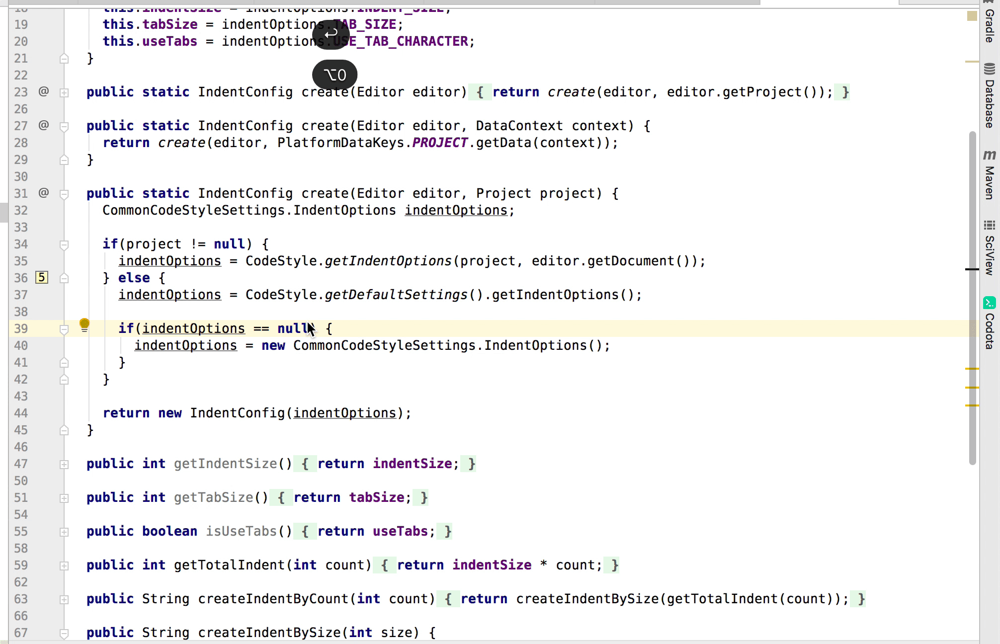
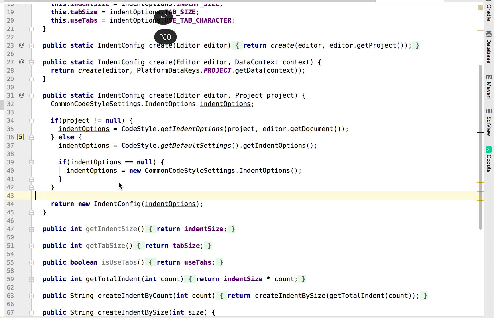
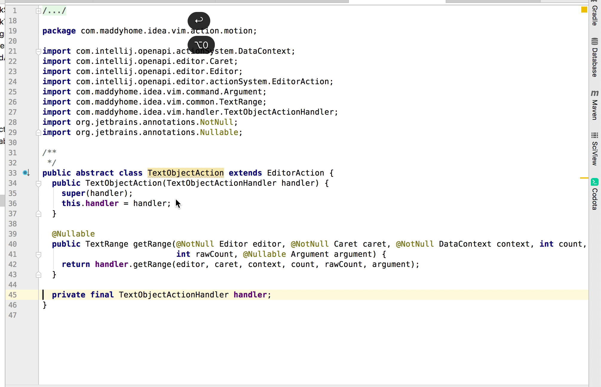

# intellij-enhance
增加一些非常好用的action，这些action都是平时实战（搬砖) 得出来，得益于IDEA强大的PSI，所以本插件能够精准增强代码导航，代码修改等功能，
项目目的就是消除繁琐重复操作，提高生产力

# Usages
- 配置成快捷键
  * 你可以在 Preference -> Keymap  把插件的action 插件配置成快捷键
- 结合ideavim， 比如在~/.ideavimrc 配置加入 
 `nnoremap dam :action Enhance.DeleteMethod<CR>` 就可以 在 正常模式 键入dam 删除一个方法

# Features 
## SelectMethodAction
- actionId: `Enhance.SelectMethod`
- 选择当前光标所在的java方法

## DeleteMethodAction
- actionId: `Enhance.DeleteMethod`
- 删除当前光标所在的java方法

## CopyMethodAction
- actionId: `Enhance.CopyMethod`
- 复制当前光标所在的java方法

## GotoMethodNameAction
- actionId: `Enhance.GotoMethodName`
- 跳到当前方法名   
- 有时候你需要查看哪些地方调用了光标所在方法， 而且方法很长的时候， 你可以使用 快捷键执行这个action，然后再 使用快捷键 Goto Declaration 找到调用这个方法的地方

## GotoClassNameAction
- actionId: `Enhance.GotoClassName`
- 跳到当前类名   
- 看代码的时候经常需要看当前类有哪些子类实现，代码太长，类名很难找到，这个action可以直接到当前类名

# Future
后面会增加更多实用的action

# Donation

如果觉得这个项目对你有帮助，欢迎捐赠！

